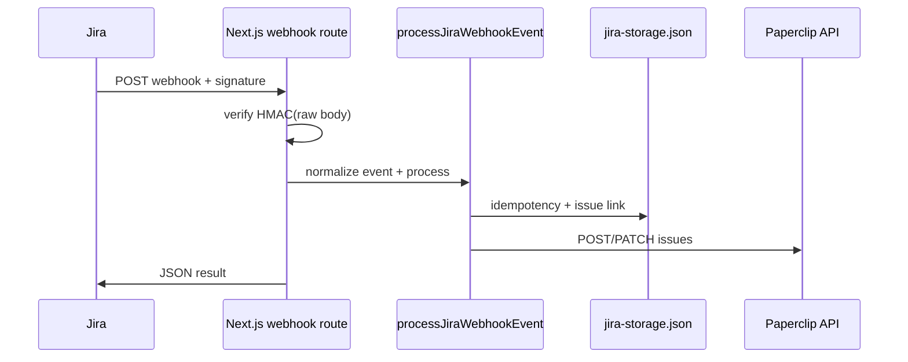

# deepconsole-jira-integration

Jira Cloud 웹훅을 받아 **서명 검증** 후, 이슈를 **Paperclip** REST API로 생성·갱신하는 Next.js(App Router) 서비스입니다. Jira 이슈와 Paperclip 내부 이슈 ID 매핑·멱등 처리·이벤트 로그는 로컬 JSON 파일(또는 지정 경로)에 저장합니다.

---

## 빠른 시작

```bash
pnpm install
cp .env.example .env.local   # 아래 환경 변수 채우기
pnpm dev
```

개발 서버 기본 주소: `http://localhost:3000`  
웹훅 엔드포인트: **`POST /integrations/jira/webhook`**

```bash
pnpm type-check   # TypeScript
pnpm test         # Vitest 단위 테스트
pnpm build && pnpm start   # 프로덕션
```

`.env.example`이 없다면, 아래 [환경 변수](#환경-변수)를 참고해 `.env.local`을 직접 만듭니다.

---

## 동작 흐름

1. Jira가 이슈 생성/수정 웹훅을 보냅니다.
2. 라우트(`src/app/integrations/jira/webhook/route.ts`)가 **원문 본문(raw body)**으로 HMAC-SHA256 서명을 검증합니다.
3. 지원 이벤트만 처리하고, 나머지는 `202`로 무시 응답합니다.
4. `processJiraWebhookEvent`가 멱등 키를 잡은 뒤, 저장소에 Jira↔Paperclip 링크가 없으면 **POST**로 이슈를 만들고, 있으면 변경 필드에 맞춰 **PATCH**로 갱신합니다.



---

## Jira 쪽 설정

### 1. 웹훅 URL

배포된 도메인 기준:

`https://<your-host>/integrations/jira/webhook`

로컬에서 Jira Cloud가 직접 치기 어렵다면 [ngrok](https://ngrok.com/) 등으로 터널을 띄운 URL을 등록합니다.

### 2. 시크릿

Jira 웹훅에 설정한 시크릿과 **동일한 값**을 서버 환경 변수 `JIRA_WEBHOOK_SECRET`에 넣습니다. 코드는 다음 헤더 중 하나의 서명을 읽습니다.

- `x-hub-signature-256` (예: `sha256=<hex>`)
- `x-hub-signature`
- `x-atlassian-webhook-signature`

다이제스트는 **hex** 또는 **base64** 형식을 모두 지원합니다.

### 3. 이벤트

처리하는 Jira `webhookEvent` 값:

| Jira 값              | 내부 타입       |
| -------------------- | --------------- |
| `jira:issue_created` | `issue.created` |
| `jira:issue_updated` | `issue.updated` |

그 외 이벤트는 본문은 받지만 **처리하지 않고** `{ "ok": true, "ignored": true }`와 HTTP **202**를 반환합니다.

---

## 환경 변수

### 웹훅 (필수)

| 변수                  | 설명                                                       |
| --------------------- | ---------------------------------------------------------- |
| `JIRA_WEBHOOK_SECRET` | Jira 웹훅 시크릿과 동일. 없으면 라우트가 500을 반환합니다. |

### Paperclip API (필수)

동기화 시 `fetch`로 호출합니다. URL은 끝의 `/`가 있어도 제거 후 사용합니다.

| 변수                        | 대체 변수              | 설명                                                       |
| --------------------------- | ---------------------- | ---------------------------------------------------------- |
| `JIRA_PAPERCLIP_API_URL`    | `PAPERCLIP_API_URL`    | Paperclip 베이스 URL (예: `https://api.example.com`)       |
| `JIRA_PAPERCLIP_API_KEY`    | `PAPERCLIP_API_KEY`    | `Authorization: Bearer …` 에 쓰는 API 키                   |
| `JIRA_PAPERCLIP_COMPANY_ID` | `PAPERCLIP_COMPANY_ID` | 회사(테넌트) ID — 경로 `/api/companies/{id}/issues`에 사용 |

### Jira Cloud (필수)

| 변수            | 설명                                                                         |
| --------------- | ---------------------------------------------------------------------------- |
| `JIRA_CLOUD_ID` | Atlassian cloud ID. 외부 키 `jira:{cloudId}:{issueId}` 및 매핑에 사용됩니다. |

### 프로젝트 매핑 (선택)

Paperclip 이슈에 넣을 `projectId`는 다음 순서로 결정됩니다.

1. `JIRA_PROJECT_MAPPING_JSON`에 Jira 프로젝트 **id** 또는 **key**(대소문자 무시) → Paperclip `projectId` 문자열 매핑
2. 매핑이 없으면 `JIRA_DEFAULT_PROJECT_ID`

`JIRA_PROJECT_MAPPING_JSON` 예시:

```json
{
  "10001": "paperclip-project-uuid-1",
  "PROJ": "paperclip-project-uuid-1"
}
```

### 로컬 저장소 (선택)

| 변수                | 설명                                                                                                            |
| ------------------- | --------------------------------------------------------------------------------------------------------------- |
| `JIRA_STORAGE_FILE` | 상태 JSON 파일의 **절대 또는 상대 경로**. 미설정 시 `<프로젝트 루트>/.paperclip/integrations/jira-storage.json` |

저장 내용에는 Jira 이슈와 Paperclip 이슈 ID 연결, 멱등 처리 상태, 이벤트 로그 등이 포함됩니다. **서버리스/읽기 전용 파일시스템**에서는 쓰기 가능한 볼륨 경로를 `JIRA_STORAGE_FILE`로 지정해야 합니다.

---

## HTTP 응답 (웹훅 라우트)

| 상태 | 의미                                                                                   |
| ---- | -------------------------------------------------------------------------------------- |
| 200  | 처리 완료. 본문에 `{ ok: true, result }` — `result`는 `processJiraWebhookEvent` 반환값 |
| 202  | 지원하지 않는 웹훅 타입 — `{ ok: true, ignored: true }`                                |
| 400  | JSON 파싱 실패 또는 페이로드 정규화 실패                                               |
| 401  | 서명 불일치 또는 시그니처 헤더 없음                                                    |
| 500  | `JIRA_WEBHOOK_SECRET` 미설정 또는 처리 중 예외                                         |

---

## 코드에서 직접 쓰기

같은 프로세스 안에서 테스트하거나 커스텀 저장소를 쓰려면 `processJiraWebhookEvent`에 옵션을 넘깁니다.

```typescript
import { JiraStorageRepository } from "@/server/integrations/jira/storage";
import {
  processJiraWebhookEvent,
  type JiraSyncEnvironment,
} from "@/server/integrations/jira/sync";
import {
  normalizeJiraWebhookEvent,
  verifyJiraWebhookSignature,
} from "@/server/integrations/jira/webhook";

const repository = await JiraStorageRepository.create({
  storeFilePath: "/tmp/jira-store.json",
  cloudId: process.env.JIRA_CLOUD_ID,
});

const environment: JiraSyncEnvironment = {
  apiUrl: "https://api.example.com",
  apiKey: "secret",
  companyId: "company-id",
  cloudId: "atlassian-cloud-id",
  defaultProjectId: "optional-paperclip-project-id",
  projectMapping: {},
};

const rawBody = "...";
const event = normalizeJiraWebhookEvent(JSON.parse(rawBody), new Headers());

const result = await processJiraWebhookEvent({
  event,
  rawBody,
  repository,
  environment,
});
```

서명만 검증할 때는 `verifyJiraWebhookSignature({ rawBody, secret, signatureHeader })`를 사용합니다. **반드시 검증 전에 본문을 문자열로 읽고**, JSON 파싱은 그 다음에 하세요(라우트와 동일한 순서).

---

## Paperclip API (이 코드가 호출하는 엔드포인트)

- **이슈 생성:** `POST /api/companies/{companyId}/issues`  
  본문: `title`, `description`, 선택적으로 `status`, `priority`, `projectId`
- **이슈 갱신:** `PATCH /api/issues/{internalIssueId}`  
  변경된 Jira 필드에 맞춰 부분 업데이트

Jira 상태·우선순위 이름은 코드 안에서 Paperclip 쪽 enum 값으로 매핑됩니다(`sync.ts`의 `mapStatus`, `mapPriority`).

---

## 에이전트 스킬 (`.agents/skills`)

이 레포에는 Paperclip 연동용 Cursor/에이전트 스킬 문서가 포함되어 있습니다. DeepConsole 모노레포에서 쓰던 것과 동일하게 `.agents/skills/` 아래를 에이전트 설정의 스킬 경로에 맞춰 두면 됩니다.

---

## 라이선스 및 기여

이 패키지는 `package.json`의 `private: true` 설정을 따릅니다. 사내/개인 용도에 맞게 조정하세요.

문제가 있으면 웹훅 요청의 **raw body**, 사용 중인 Jira 이벤트 타입, 서버 로그의 Paperclip API 오류 메시지를 함께 확인하는 것이 좋습니다.
