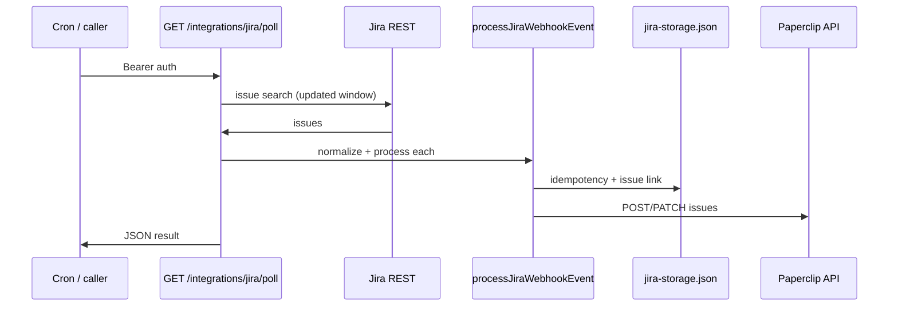

# deepconsole-jira-integration

Jira Cloud **REST 폴링**(기본 5분 간격; `vercel.json` Cron)으로 이슈를 감지한 뒤 **Paperclip** REST API로 생성·갱신하는 Next.js(App Router) 서비스입니다. Jira 이슈와 Paperclip 내부 이슈 ID 매핑·멱등 처리·이벤트 로그는 로컬 JSON 파일(또는 지정 경로)에 저장합니다.

> **폴링 전용:** HTTP **웹훅 엔드포인트**(`POST /integrations/jira/webhook`)는 이 레포에서 **제거**되었습니다. Jira 관리 콘솔에 예전 URL로 웹훅이 남아 있으면 **삭제**하세요. 폴링과 동일한 이벤트 정규화 타입은 여전히 `src/server/integrations/jira/webhook.ts`에서 재사용합니다(이름만 유지).

---

## 빠른 시작

```bash
pnpm install
cp .env.example .env.local   # 아래 환경 변수 채우기
pnpm dev
```

개발 서버 기본 주소: `http://localhost:3000`  
폴링 트리거: **`GET` 또는 `POST /integrations/jira/poll`** (`Authorization: Bearer …` — 아래 [폴링](#jira-rest-폴링-5분-간격) 참고)

```bash
pnpm type-check   # TypeScript
pnpm test         # Vitest 단위 테스트
pnpm build && pnpm start   # 프로덕션
```

`.env.example`이 없다면, 아래 [환경 변수](#환경-변수)를 참고해 `.env.local`을 직접 만듭니다.

---

## 동작 흐름

### 폴링

1. 스케줄(예: Vercel Cron **5분마다**)이 `GET /integrations/jira/poll`을 호출합니다. 수동으로도 같은 URL에 `Authorization: Bearer`를 붙여 호출할 수 있습니다.
2. 서버가 Jira REST `POST .../search`로 `updated`가 최근 **N분** 이내인 이슈를 가져옵니다. 기본 JQL은 `updated >= -10m`이며, 5분 주기와 겹침을 두어 누락을 줄입니다. `JIRA_POLL_LOOKBACK_MINUTES`로 조정합니다.
3. 각 이슈를 내부 이벤트로 정규화한 뒤 **같은** `processJiraWebhookEvent`로 Paperclip에 반영합니다. 멱등 키는 `poll:{cloudId}:{issueId}:{fields.updated}` 형태입니다.



---

## Jira 쪽 설정

웹훅 URL·시크릿은 **필요 없습니다**(엔드포인트 제거). 대신 아래 [Jira REST 폴링](#jira-rest-폴링-5분-간격)에 따라 **API 토큰**과 **Cloud ID**를 준비합니다.

---

## Jira REST 폴링 (5분 간격)

프로젝트 루트의 [`vercel.json`](vercel.json)에 Vercel Cron이 등록되어 있으며, **5분마다** `GET /integrations/jira/poll`을 호출합니다. Vercel에 배포할 때만 자동 실행되며, 다른 호스팅이면 동일 주기로 외부 크론(또는 스케줄 잡)이 같은 요청을 내면 됩니다.

1. [Atlassian 계정 API 토큰](https://id.atlassian.com/manage-profile/security/api-tokens)을 만들고, `JIRA_ATLASSIAN_EMAIL` + `JIRA_ATLASSIAN_API_TOKEN`(또는 `ATLASSIAN_EMAIL` + `JIRA_API_TOKEN`)을 설정합니다.
2. `CRON_SECRET` 또는 `JIRA_POLL_SECRET`에 임의의 긴 문자열을 넣습니다. Vercel에서는 대시보드에 **`CRON_SECRET`**을 등록하면 Cron 요청에 `Authorization: Bearer <CRON_SECRET>`이 붙습니다. 로컬에서 수동 호출할 때도 같은 값을 헤더에 넣습니다.

   ```bash
   curl -sS -H "Authorization: Bearer $JIRA_POLL_SECRET" \
     http://localhost:3000/integrations/jira/poll
   ```

3. 선택: `JIRA_POLL_JQL`에 `AND project = PROJ`처럼 **시간 조건 뒤에 붙는** JQL 조각을 넣어 범위를 줄입니다.

---

## 환경 변수

### 폴링 (폴링 라우트에 필수)

| 변수                         | 대체 변수         | 설명                                                                                    |
| ---------------------------- | ----------------- | --------------------------------------------------------------------------------------- |
| `CRON_SECRET`                | —                 | Vercel Cron이 전송하는 Bearer 토큰과 동일하게 검증. 설정 시 `JIRA_POLL_SECRET`보다 우선 |
| `JIRA_POLL_SECRET`           | —                 | 수동/외부 크론 호출용 Bearer 공유 비밀. `CRON_SECRET`이 없을 때 사용                    |
| `JIRA_ATLASSIAN_EMAIL`       | `ATLASSIAN_EMAIL` | Jira Cloud API Basic 인증용 Atlassian 계정 이메일                                       |
| `JIRA_ATLASSIAN_API_TOKEN`   | `JIRA_API_TOKEN`  | 위 계정의 API 토큰                                                                      |
| `JIRA_POLL_LOOKBACK_MINUTES` | —                 | JQL `updated >= -Nm`의 **N** (기본 `10`, 1–1440)                                        |
| `JIRA_POLL_JQL`              | —                 | 시간 조건 뒤에 이어 붙는 JQL (앞에 공백 포함해 `AND …` 형태 권장)                       |

### Paperclip API (필수)

동기화 시 `fetch`로 호출합니다. URL은 끝의 `/`가 있어도 제거 후 사용합니다.

| 변수                                         | 대체 변수                               | 설명                                                                           |
| -------------------------------------------- | --------------------------------------- | ------------------------------------------------------------------------------ |
| `JIRA_PAPERCLIP_API_URL`                     | `PAPERCLIP_API_URL`                     | Paperclip 베이스 URL (예: `https://api.example.com`)                           |
| `JIRA_PAPERCLIP_API_KEY`                     | `PAPERCLIP_API_KEY`                     | `Authorization: Bearer …` 에 쓰는 API 키                                       |
| `JIRA_PAPERCLIP_COMPANY_ID`                  | `PAPERCLIP_COMPANY_ID`                  | 회사(테넌트) ID — 경로 `/api/companies/{id}/issues`에 사용                     |
| `JIRA_PAPERCLIP_NEW_ISSUE_ASSIGNEE_AGENT_ID` | `PAPERCLIP_NEW_ISSUE_ASSIGNEE_AGENT_ID` | (선택) Jira→Paperclip **신규** 이슈에만 `assigneeAgentId`로 넣을 에이전트 UUID |

### Jira Cloud (필수)

| 변수            | 설명                                                                         |
| --------------- | ---------------------------------------------------------------------------- |
| `JIRA_CLOUD_ID` | Atlassian cloud ID. 외부 키 `jira:{cloudId}:{issueId}` 및 매핑에 사용됩니다. |

### 프로젝트 매핑 (선택)

Paperclip 이슈에 넣을 `projectId`는 다음 순서로 결정됩니다.

1. `JIRA_PROJECT_MAPPING_JSON`에 Jira 프로젝트 **id** 또는 **key**(대소문자 무시) → Paperclip `projectId` 문자열 매핑
2. 매핑이 없으면 `JIRA_DEFAULT_PROJECT_ID`

`JIRA_PROJECT_MAPPING_JSON` 예시:

```json
{
  "10001": "paperclip-project-uuid-1",
  "PROJ": "paperclip-project-uuid-1"
}
```

### 로컬 저장소 (선택)

| 변수                | 설명                                                                                                            |
| ------------------- | --------------------------------------------------------------------------------------------------------------- |
| `JIRA_STORAGE_FILE` | 상태 JSON 파일의 **절대 또는 상대 경로**. 미설정 시 `<프로젝트 루트>/.paperclip/integrations/jira-storage.json` |

저장 내용에는 Jira 이슈와 Paperclip 이슈 ID 연결, 멱등 처리 상태, 이벤트 로그 등이 포함됩니다. **서버리스/읽기 전용 파일시스템**에서는 쓰기 가능한 볼륨 경로를 `JIRA_STORAGE_FILE`로 지정해야 합니다.

---

## HTTP 응답 (폴링 라우트)

| 상태 | 의미                                                                                        |
| ---- | ------------------------------------------------------------------------------------------- |
| 200  | `{ ok: true, scanned, results }` — `results`는 이슈별 처리 결과(성공 시 `outcome`/`reason`) |
| 401  | `Authorization: Bearer` 없음·불일치                                                         |
| 500  | `CRON_SECRET`/`JIRA_POLL_SECRET` 미설정, Jira 검색 실패, 또는 처리 중 예외                  |

---

## 코드에서 직접 쓰기

같은 프로세스 안에서 테스트하거나 커스텀 저장소를 쓰려면 `processJiraWebhookEvent`에 옵션을 넘깁니다.

```typescript
import { JiraStorageRepository } from "@/server/integrations/jira/storage";
import {
  processJiraWebhookEvent,
  type JiraSyncEnvironment,
} from "@/server/integrations/jira/sync";
import { normalizeJiraWebhookEvent } from "@/server/integrations/jira/webhook";

const repository = await JiraStorageRepository.create({
  storeFilePath: "/tmp/jira-store.json",
  cloudId: process.env.JIRA_CLOUD_ID,
});

const environment: JiraSyncEnvironment = {
  apiUrl: "https://api.example.com",
  apiKey: "secret",
  companyId: "company-id",
  cloudId: "atlassian-cloud-id",
  defaultProjectId: "optional-paperclip-project-id",
  projectMapping: {},
  newIssueAssigneeAgentId: null,
};

const rawBody = "...";
const event = normalizeJiraWebhookEvent(JSON.parse(rawBody), new Headers());

const result = await processJiraWebhookEvent({
  event,
  rawBody,
  repository,
  environment,
});
```

---

## Paperclip API (이 코드가 호출하는 엔드포인트)

- **이슈 생성:** `POST /api/companies/{companyId}/issues`  
  본문: `title`, `description`(Jira 메타 + **Plan (draft, from Jira)** 구역), 선택적으로 `status`, `priority`, `projectId`, `assigneeAgentId`(환경변수로만, 신규 생성 시에만)
- **이슈 갱신:** `PATCH /api/issues/{internalIssueId}`  
  변경된 Jira 필드에 맞춰 부분 업데이트

Jira 상태·우선순위 이름은 코드 안에서 Paperclip 쪽 enum 값으로 매핑됩니다(`sync.ts`의 `mapStatus`, `mapPriority`).

---

## 에이전트 스킬 (`.agents/skills`)

이 레포에는 Paperclip 연동용 Cursor/에이전트 스킬 문서가 포함되어 있습니다. DeepConsole 모노레포에서 쓰던 것과 동일하게 `.agents/skills/` 아래를 에이전트 설정의 스킬 경로에 맞춰 두면 됩니다.

---

## 라이선스 및 기여

이 패키지는 `package.json`의 `private: true` 설정을 따릅니다. 사내/개인 용도에 맞게 조정하세요.

문제가 있으면 폴링 응답의 `results`, Jira 검색 JQL·`updated` 윈도, 서버 로그의 Paperclip API 오류 메시지를 함께 확인하는 것이 좋습니다.
